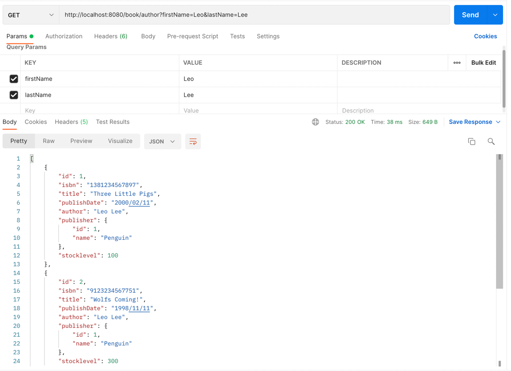

# Book Store REST API Application

## API Calls (http://localhost:8080)

### Book (/book):

* GET (/all): to get all the books from table
* GET (/isbn/{isbn}): to get book by isbn
* GET (/title/{title}): to get book by title
* GET (/author): to get book by author (RequestParam: firstName=John&lastName=Doe)
* GET (/publisher/{publisher}): to get book by publisher
* PUT (/authorId/{authorId}/publlisherId/{publisherId}): to create book with book information + author + publisher (RequestBody: {"title": "ABC", "isbn": "1234567898765", "publishDate": "2000/01/23"})
* POST (/{id}): to update information of book (RequestBody: {"title": "ABC", "isbn": "1234567898765", "publishDate": "2000/01/23"})
* DELETE (/{id}): to delete a book record

### Author (/author):

* GET (/all): to get all the authors from table
* GET (/{id}): to get author by id
* GET (/name): to get author by firstName + lastName (RequestParam: firstName=John&lastName=Doe)
* PUT: to create new Author record: (RequestBody: {"firstName": "John", "lastName": "Doe"})
* POST (/{id}): to update Author information: (RequestBody: {"firstName": "John", "lastName": "Doe"})
* DELETE (/{id}): to delete an author record

### Publisher (/publisher):

* GET (/all): to get all publishers
* GET (/{id}): to get publisher by id
* PUT: to create a new publisher (RequestBody: {"name": "Penguin"})
* POST (/{id}): to update publisher information (RequestBody: {"name": "Penguin"})
* DELETE (/{id}): to delete a publisher record

### StockLevel (/stocklevel):

* GET (/all): to get all stock level status (RequestParam: qty=100)
* GET (/{bookId}): to get stock level status by book id
* POST (/{id}): to update stock level status by stock id

### Transaction (/transaction):

* GET: to get all transaction record
* PUT: to make a purchase action, it can be a book or a group of books 
  (RequestBody: [{"customerName": "John Doe", "bookId": 4, "qty": 10}, {"customerName": "John Doe", "bookId": 2, "qty": 5}])

## Test Demonstration

### Author

* PUT:  
* GET (/all): 
* GET (/{id}): 
* GET (/name): 
* POST (/{id}):  
* DELETE (/{id}): 

### Book

* GET (/all): 
* GET (/isbn/{isbn}): 
* GET (/title/{title}): 
* GET (/author): 
* GET (/publisher/{publisher}): 
* PUT (/authorId/{authorId}/publlisherId/{publisherId}): 
* POST (/{id}): 
* DELETE (/{id}):  

### Publisher:

* GET (/all): 
* GET (/{id}): 
* PUT: 
* POST (/{id}):  
* DELETE (/{id}): 

### StockLevel:

* POST (/{id}): 
* GET (/all): 
* GET (/{bookId}): 

### Transaction (/transaction):

* PUT: 
* GET: 

* Stock level changed after transaction:
* 

## Error Message

* Missing Request Body Property: 
* Missing Request Param: 
* Required Entity Cannot be Found: 
* Calling Non-existent Methods: 